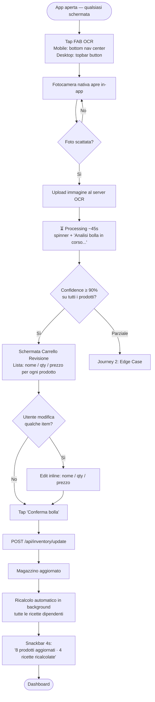
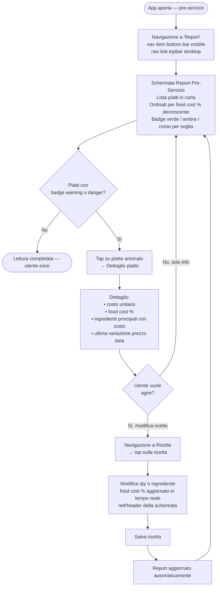
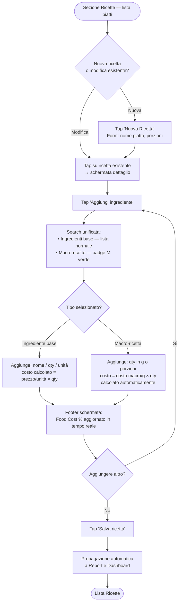
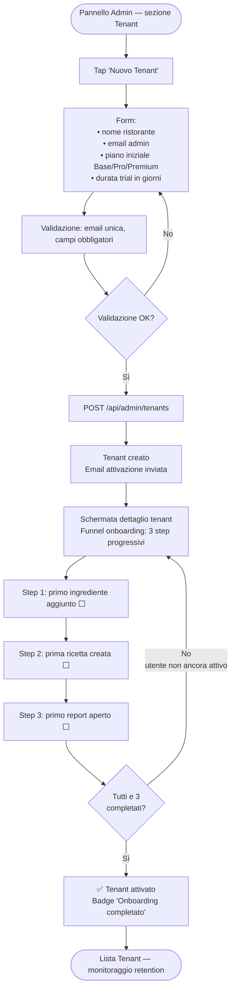

# UX Design Specification — Food Cost SaaS

**Author:** Intre
**Date:** 2026-03-13

---

## Executive Summary

### Project Vision

Web app SaaS mobile-first (PWA) per ristoratori italiani singoli che restituisce controllo finanziario operativo a chi lavora 14+ ore al giorno senza visibilità sui margini. Il prodotto risolve tre problemi interconnessi: impossibilità di calcolare il costo reale di un piatto, mancanza di aggiornamento automatico dei prezzi alla ricezione della merce, e assenza di compliance HACCP digitalizzata per piccole realtà.

Il differenziatore primario è l'**OCR bolla fornitore via fotocamera mobile**: il ristoratore fotografa la bolla in cucina e magazzino si aggiorna in 45 secondi, senza digitazione. Feature strutturale: **macro-ricette come ingredienti** (fondo bruno, salse base) con costo reale propagato a cascata in tutte le preparazioni che le contengono.

Posizionamento: *"Pensato da chi lavora in cucina, non da un commercialista."*

### Target Users

| Segmento | % TAM | Driver primario | WTP/mese |
|---|---|---|---|
| **A — Chef-owner artigiano** (es. Matteo) | ~60% | Risparmio tempo, OCR | €30–60 |
| **B — Manager-owner efficienza** | ~25% | Precisione, sostituzione Excel | €60–120 |
| **C — Owner ansioso compliance** | ~15% | HACCP, ispezioni | €40–80 |

**Contesto d'uso:** break tra i turni o post-servizio (22:00+), in piedi in cucina, telefono in mano, grembiule addosso. Massimo 5 minuti per task. Forte resistenza alla curva di apprendimento. Bassa tolleranza per software percepito come "da commercialista".

### Key Design Challenges

1. **Onboarding a zero friction** — il database ingredienti va costruito da zero. Se il primo accesso richiede 30 minuti di inserimento dati, il prodotto è morto. La UX deve trasformare l'onboarding in un flusso guidato progressivo, non un form infinito.

2. **OCR = momento di verità** — il "carrello revisione bolla" post-scan è l'interazione più critica del prodotto. Deve gestire con grazia il caso di errori OCR (es. 3/9 prodotti non riconosciuti) senza bloccare l'utente né farlo sentire in colpa.

3. **Lettura dati in contesto d'uso reale** — il Report Pre-Servizio viene letto in cucina con illuminazione scarsa, schermo non pulito. La gerarchia visiva deve permettere di leggere food cost % e allerte in 10 secondi, senza sforzo cognitivo.

4. **Navigazione tra ricette ↔ ingredienti ↔ macro-ricette** — la relazione ricorsiva (macro-ricetta come ingrediente) è potente ma potenzialmente disorientante. La UX deve rendere visibile la catena di costo senza esporre la complessità tecnica sottostante.

### Design Opportunities

1. **"Scan & Go" come gesto iconico** — il momento OCR può diventare il gesto distintivo e riconoscibile del prodotto. Se rapido e soddisfacente diventa il contenuto di word-of-mouth naturale tra chef.

2. **Feedback di costo immediato** — ogni modifica a una ricetta mostra in tempo reale il nuovo food cost % con indicatore cromatico (verde/giallo/rosso). Rende il prodotto immediatamente gratificante e didattico senza richiedere formazione esplicita.

3. **Dashboard fissa e leggibile** — la dashboard è sempre uguale indipendentemente dall'orario del giorno: struttura stabile, nessuna logica situazionale. La chiarezza e consistenza visiva sono la priorità.

---

## Core User Experience

### Defining Experience

L'azione core più frequente è l'**aggiornamento del magazzino tramite OCR bolla fornitore** — fotografare la bolla, rivedere il carrello estratto, confermare. È il gesto che definisce il prodotto e lo distingue da qualsiasi alternativa. La seconda azione ad alta frequenza è la **consultazione del food cost di ricetta** (vedere se un piatto è ancora in target dopo una variazione di prezzo).

L'azione assolutamente critica da non sbagliare è il **calcolo food cost in tempo reale**: ogni modifica a prezzi o quantità deve propagarsi immediatamente e silenziosamente a tutte le ricette e macro-ricette dipendenti. L'utente non interviene — il sistema ricalcola tutto in background.

### Platform Strategy

**PWA responsive** — nessuna app store, installabile da browser su qualsiasi device.

| Contesto | Device | Uso prevalente |
|---|---|---|
| In cucina / magazzino | Smartphone | OCR scan, check rapido prezzi, alert food cost |
| Ufficio / casa | Desktop o tablet | Onboarding, gestione ricette, macro-ricette, pannello admin |
| Pre-servizio | Tablet o smartphone | Report food cost, lettura margini |

Nessuna funzionalità offline richiesta. Tutte le operazioni sono cloud-first.

### Effortless Interactions

- **Propagazione costo a cascata**: quando cambia il prezzo di un ingrediente o il costo di una macro-ricetta, tutti i food cost dipendenti si aggiornano automaticamente — zero azione utente richiesta.
- **OCR scan**: aprire la fotocamera, fotografare, attendere 45 secondi. Il sistema fa il resto — l'utente rivede solo, non inserisce.
- **Lettura food cost**: il valore % di ogni piatto è sempre visibile in primo piano, con indicatore cromatico (verde/giallo/rosso) senza dover aprire dettagli.

### Critical Success Moments

1. **Il primo scan OCR riuscito** — vedere 8+ prodotti riconosciuti e il magazzino aggiornato senza aver digitato nulla. È il momento di attivazione: chi lo vive non torna ai fogli Excel.
2. **Il primo ricalcolo automatico** — dopo aver confermato una bolla, aprire una ricetta e vedere il food cost già aggiornato senza aver fatto nulla. Momento di fiducia nel sistema.
3. **Il primo report pre-servizio leggibile in 10 secondi** — vedere tutti i piatti in carta con food cost % e allerte, in un colpo d'occhio.
4. **Il fallimento gestito con grazia** — OCR con 3/9 errori: l'app mostra chiaramente cosa non ha capito, offre editing inline, non blocca e non fa sentire l'utente in errore.

### Experience Principles

1. **Il sistema lavora, l'utente decide** — ogni calcolo, aggiornamento e propagazione è automatico. L'utente interviene solo per confermare o correggere, mai per ricalcolare.
2. **Mobile è il contesto primario, desktop è benvenuto** — ogni interazione deve funzionare con un pollice su schermo da 6", ma guadagnare spazio e comodità su desktop/tablet senza perdere semplicità.
3. **Gli errori sono attesi, non vergognosi** — OCR sbaglia, i prezzi cambiano in modo anomalo. Il prodotto gestisce queste situazioni con tono neutro, istruzioni chiare, nessuna frizione aggiuntiva.
4. **Il costo è sempre visibile, mai nascosto** — food cost % è informazione di primo livello ovunque: nelle ricette, nella dashboard, nel report. Non serve "aprire i dettagli" per sapere se un piatto sta rendendo.

---

## Desired Emotional Response

### Primary Emotional Goals

L'emozione target primaria è il **controllo professionale** — la sensazione di un operatore che ha i numeri sotto mano senza sforzo, non di un utente che usa un software. Non euforia, non sorpresa: padronanza tranquilla. "So esattamente dove sono."

Questo è l'opposto diretto dello stato emotivo di partenza: l'ansia cronica da controllo mancato (calcoli a mano alle 22:30, dubbi sui margini, aggiornamenti prezzi rimandati).

### Emotional Journey Mapping

| Momento | Emozione attesa |
|---|---|
| Prima scoperta / landing | Riconoscimento — "questo parla di me" |
| Onboarding (primo ingrediente, prima ricetta) | Competenza progressiva — ogni step completato dà senso di avanzamento |
| Primo scan OCR riuscito | Fiducia — "funziona davvero, senza sforzo" |
| Primo ricalcolo automatico post-bolla | Controllo — "il sistema è allineato alla realtà" |
| Lettura report pre-servizio | Padronanza — "so cosa sta succedendo nel mio ristorante" |
| Errore OCR / anomalia prezzo | Neutralità operativa — nessuna frizione emotiva, solo informazione azionabile |
| Ritorno quotidiano al prodotto | Routine professionale — come controllare la mise en place |

### Micro-Emotions

| Emozione positiva da coltivare | Emozione negativa da evitare |
|---|---|
| Confidenza | Confusione |
| Fiducia nel sistema | Dubbio sulla correttezza dei dati |
| Padronanza | Senso di inadeguatezza (errori OCR, dati mancanti) |
| Soddisfazione operativa (task completato) | Frustrazione da blocchi o passi obbligatori non chiari |
| Chiarezza | Sovraccarico cognitivo |

### Design Implications

- **Controllo → UI densa di informazioni ma gerarchizzata** — dati sempre visibili, organizzati per importanza. Nessun dato nascosto dietro menu superflui.
- **Professionale → linguaggio neutro, tipografia pulita, nessuna iconografia infantile** — no emoji decorative, no micro-copy troppo entusiasta ("Ottimo lavoro! 🎉"). Il prodotto parla come un professionista a un professionista.
- **Neutro-informativo sugli errori → messaggi di stato descrittivi, non valutativi** — "3 prodotti non riconosciuti — revisione richiesta" non "Oops! Qualcosa è andato storto". Nessun colore rosso allarmistico per situazioni ordinarie.
- **Fiducia → feedback immediato e preciso** — ogni azione mostra il risultato in tempo reale (food cost aggiornato, magazzino modificato). L'utente non si chiede mai "ha salvato?", "ha ricalcolato?".

### Emotional Design Principles

1. **Professionale sempre, caloroso quando serve** — il tono è quello di uno strumento serio. L'unico momento di calore è nell'onboarding iniziale (accoglienza) e nelle notifiche di successo — mai forzato.
2. **Gli errori non interrompono il flusso emotivo** — un errore OCR non è un fallimento del prodotto né dell'utente. Il sistema lo comunica con la stessa neutralità con cui mostra un prezzo aggiornato.
3. **La padronanza si costruisce per strati** — l'utente principiante sente di avere controllo sui fondamentali; l'utente esperto sente di avere controllo totale. Il prodotto non espone mai più complessità di quanto l'utente sia pronto a gestire.
4. **Nessuna celebrazione del banale** — completare una ricetta o aggiornare un prezzo è routine professionale, non un'impresa. Il feedback è sobrio: conferma visiva, dati aggiornati, avanti.

---

## UX Pattern Analysis & Inspiration

### Inspiring Products Analysis

**Revolut** — dashboard finanziaria professionale, densa di dati ma perfettamente gerarchizzata. Feedback immediato su ogni transazione (stato visibile in tempo reale). Tono neutro-informativo anche sulle notifiche critiche. Gestione errori sobria. Onboarding step-by-step con progressione chiara. Riferimento diretto per: dashboard food cost, stato magazzino, comunicazione errori.

**Notion** — struttura a blocchi che permette relazioni tra entità complesse (database linkati) senza esporre la complessità tecnica. Viste multiple della stessa informazione. Riferimento diretto per: navigazione ingredienti ↔ ricette ↔ macro-ricette, gestione dati strutturati.

**Airbnb** — schermata di revisione/conferma prima di ogni azione irreversibile. Onboarding progressivo e contestuale. Foto come azione primaria nativa. Riferimento diretto per: carrello revisione bolla post-OCR, onboarding progressivo, scan come gesto primario.

**Spotify** — navigazione bottom bar persistente su mobile. Azione primaria sempre accessibile senza tornare alla home. Tap target grandi, ottimizzati per uso con una mano. Riferimento diretto per: navigazione mobile, accesso rapido alle sezioni principali.

**Instagram** — fotocamera come azione primaria raggiungibile con un tap dal centro della bottom bar. FAB centrale per l'azione core. Riferimento diretto per: posizionamento del pulsante OCR scan, gesto nativo con la fotocamera.

### Transferable UX Patterns

**Pattern di navigazione:**
- **Bottom navigation persistente (Spotify/Instagram)** — 4-5 sezioni principali sempre accessibili su mobile: Dashboard, Magazzino, Ricette, Bolle, [Altro]. Nessun hamburger menu nascosto.
- **Sidebar su desktop (Notion/Revolut)** — stessa struttura di navigazione espansa in sidebar fissa su schermi larghi, senza cambiare il modello mentale dell'utente.

**Pattern di interazione:**
- **FAB centrale per OCR scan (Instagram)** — il pulsante "Scansiona bolla" è il centro visivo e funzionale della bottom bar su mobile. Non è sepolto in un menu.
- **Schermata di revisione prima di confermare (Airbnb)** — il "carrello post-OCR" segue il pattern della booking review: lista di item con quantità/prezzo, elementi anomali evidenziati, CTA chiara per confermare o modificare.
- **Feedback in-place e immediato (Revolut)** — dopo ogni conferma, il risultato appare inline senza navigare altrove. "Magazzino aggiornato — 8 prodotti modificati" compare nella stessa schermata, poi scompare.
- **Relazioni tra entità senza esporre complessità (Notion)** — le macro-ricette appaiono come ingredienti normali nella lista, con un'icona distintiva. Il costo si mostra già calcolato. Chi vuole "aprire" la macro-ricetta può farlo, ma non è obbligatorio capire la struttura ricorsiva.
- **Onboarding contestuale e progressivo (Airbnb)** — non chiedere tutto al primo accesso. Guida l'utente ad aggiungere i primi 3 ingredienti, poi la prima ricetta, poi il primo report — ogni step sbloccato dal precedente.

**Pattern visivi:**
- **Indicatori cromatici sobri (Revolut)** — verde/giallo/rosso per food cost %, senza icone cariche o animazioni. Il colore è informazione, non decorazione.
- **Tipografia gerarchizzata per densità dati (Revolut/Notion)** — testo grande per il valore principale (es. "34%"), testo piccolo per il contesto (es. "food cost — soglia: 32%").
- **Card compatte scorribili (Spotify)** — ogni ricetta/ingrediente è una card con le informazioni essenziali visibili senza tap. Il tap apre il dettaglio.

### Anti-Patterns to Avoid

- **Onboarding obbligatorio e lungo** — non bloccare l'utente con wizard da 10 step prima di poter usare il prodotto.
- **Menu hamburger come navigazione primaria** — su mobile nasconde le sezioni principali e aumenta il costo cognitivo.
- **Messaggi di errore con linguaggio emotivo** — no "Oops!", no punti esclamativi, no colori rosso allarme per errori OCR parziali ordinari.
- **Celebrazioni di ogni micro-azione** — toast di successo per ogni salvataggio, badge, streak. Aggiungono rumore senza valore professionale.
- **Dati nascosti dietro "Vedi di più"** — il food cost % non deve richiedere un tap aggiuntivo per essere visibile nelle liste di ricette.
- **Viste diverse su mobile e desktop con modelli mentali diversi** — stesso vocabolario, stessa struttura, più spazio su desktop.

### Design Inspiration Strategy

**Da adottare direttamente:**
- Bottom navigation persistente su mobile, sidebar su desktop (Spotify/Notion)
- FAB centrale per OCR scan come azione primaria (Instagram)
- Schermata revisione pre-conferma per il carrello bolla (Airbnb)
- Feedback in-place sobrio e immediato (Revolut)
- Indicatori cromatici puliti per food cost % (Revolut)

**Da adattare:**
- Il modello di relazioni tra database di Notion → semplificato per utente non-tecnico: macro-ricette visibili come ingredienti normali con badge distintivo
- L'onboarding progressivo di Airbnb → contestualizzato per la sequenza ingredienti → ricette → report del dominio food cost

**Da evitare:**
- Qualsiasi pattern da gestionale ERP tradizionale (form dense, navigazione ad albero, workflow obbligatori)
- Micro-celebrazioni e gamification da app consumer (non allineati al tono professionale)

---

## Design System Foundation

### Design System Choice

**Angular Material + Tailwind CSS** su framework **Angular**.

Angular Material fornisce componenti accessibili, maturi e ben documentati nativi dell'ecosistema Angular. Tailwind CSS sovrascrive e integra lo stile per raggiungere il tono visivo target (dati densi, tipografia gerarchizzata, indicatori cromatici sobri) senza essere vincolati all'estetica Material Design di default.

### Rationale for Selection

- **Maturità e affidabilità** — Angular Material è il design system ufficiale Angular: zero rischi di libreria abbandonata, documentazione eccellente, accessibilità inclusa
- **Tono visivo personalizzabile** — Angular Material theming system (M3) + Tailwind CSS utilitario permette di ottenere l'identità visiva Revolut/Notion senza partire da zero
- **PWA responsive mobile/desktop** — Tailwind gestisce breakpoint e layout adattivi; Angular service workers per la PWA
- **Velocity + identità** — il team usa strumenti familiari all'ecosistema Angular, minimizzando la curva di apprendimento; Tailwind garantisce identità visiva distinta da Material Design generico

### Implementation Approach

- **Angular** come framework SPA/PWA
- **Angular Material** per componenti base (form fields, dialog, table, select, snackbar, badge, bottom sheet)
- **Tailwind CSS** per layout, spacing, tipografia, colori brand, responsive breakpoints
- **Angular CDK** per overlay, virtual scroll (liste ingredienti/ricette lunghe), drag-and-drop se necessario
- **PWA manifest + Angular service worker** per installabilità su mobile e desktop

### Customization Strategy

- **Angular Material M3 theming** — palette brand definita tramite `@angular/material` theme tokens: colori primary, secondary, error calibrati sul brand (non il Material blue di default)
- **Tailwind config** — design tokens (colori food cost: success/warning/danger, font scale, spacing) definiti in `tailwind.config.ts` e condivisi con il tema Angular Material dove possibile
- **Componenti custom** — solo per pattern non coperti da Angular Material: OCR scan viewer, food cost badge con soglie configurabili, carrello revisione bolla, indicatore cromatico food cost inline nelle card ricette

---

## 2. Core User Experience

### 2.1 Defining Experience

**"Scan & Aggiorna"** — fotografare la bolla del fornitore e vedere il magazzino aggiornato con prezzi e quantità reali in meno di 2 minuti, senza digitare nulla.

È l'interazione che Matteo descriverebbe a un collega chef: *"Faccio una foto alla bolla in cucina e l'app aggiorna tutto da sola."* Tutto il resto del prodotto — ricette, food cost, report — dipende da questo momento. Se il magazzino è aggiornato, i numeri sono veri. Se i numeri sono veri, le decisioni sono informate.

### 2.2 User Mental Model

**Come risolvono il problema oggi:** aggiornamento manuale prezzi su foglio Excel o quaderno, oppure non lo fanno e lavorano con prezzi teorici sfasati settimane indietro.

**Modello mentale che portano:** la bolla di carta è il documento di riferimento — contiene la verità su cosa è arrivato e a quale prezzo. L'utente si aspetta che il digitale replichi quello che fa con carta e penna, non che lo sostituisca con qualcosa di incomprensibile.

**Metafora familiare da sfruttare:** il "carrello della spesa" — lista di item con quantità e prezzo, modificabili prima di confermare. È un pattern che chiunque abbia usato un e-commerce conosce.

**Aspettative implicite:**
- Il sistema deve capire la bolla meglio di quanto l'utente si aspetti (piacevole sorpresa se riconosce 8/9)
- Gli errori OCR sono attesi e normali — l'utente non si sorprende se qualcosa non viene riconosciuto
- Nessuna azione è irreversibile prima della conferma esplicita — il magazzino non cambia finché l'utente non preme "Conferma"

**Dove si aspettano frizione:** la correzione manuale degli item non riconosciuti. Deve essere veloce e inline, non aprire una nuova schermata.

### 2.3 Success Criteria

- **Velocità:** dal tap "Scansiona bolla" al magazzino aggiornato in meno di 2 minuti (inclusa revisione)
- **Chiarezza:** ogni item estratto mostra nome, quantità, unità di misura, prezzo — confrontato con il valore precedente a magazzino
- **Controllo:** l'utente può modificare ogni campo inline prima di confermare; nessuna modifica è applicata senza conferma esplicita
- **Feedback immediato:** dopo "Conferma", il sistema mostra inline "Magazzino aggiornato — 8 prodotti modificati" con lista compatta; le ricette impattate mostrano il food cost aggiornato già alla prossima apertura
- **Gestione anomalie senza blocchi:** item non riconosciuti (confidence bassa) sono evidenziati con badge ⚠️, ma non bloccano il flusso — l'utente può confermare il resto e correggere solo quelli

### 2.4 Novel vs. Established Patterns

Il flusso "Scan & Aggiorna" combina pattern familiari in modo innovativo per il dominio:

- **Fotocamera come input primario** (pattern noto da Instagram, WhatsApp) → applicato a documento business invece di foto personale
- **Carrello pre-conferma** (pattern noto da e-commerce / Airbnb booking review) → applicato a import dati invece di acquisto
- **Editing inline su lista** (pattern noto da note app, Notion) → applicato a correzione OCR invece di note testuali

Non è necessaria educazione all'interazione — ogni componente usa metafore già note. La novità è la combinazione e il dominio, non il gesto.

### 2.5 Experience Mechanics

**Flusso completo — Variante A (revisione esplicita obbligatoria):**

**1. Iniziazione**
- Tap sul pulsante "Scansiona bolla" — FAB centrale nella bottom navigation, sempre visibile
- Si apre la fotocamera nativa del dispositivo (no UI intermedia)
- Inquadratura assistita: overlay rettangolare guida il posizionamento della bolla nel frame

**2. Elaborazione**
- Dopo lo scatto: schermata di caricamento con feedback testuale "Analisi in corso..." (max 10–15 secondi)
- Se l'elaborazione fallisce completamente: messaggio neutro "Documento non riconosciuto — riprova con luce migliore o carica un file" con opzione upload PDF/JPG

**3. Revisione carrello (schermata centrale del flusso)**
- Lista scrollabile di tutti gli item estratti
- Ogni riga: nome ingrediente | quantità + unità | prezzo unitario | prezzo precedente a magazzino (se esiste)
- Variazioni di prezzo ≥ soglia configurabile (default +15%) evidenziate con badge `⚠️ +18%` in giallo-ambra — non rosso
- Item con confidence OCR bassa: bordo sottile arancione + icona matita per invitare alla revisione
- Item non riconosciuti: riga con campi vuoti evidenziati, editing obbligatorio prima di poter confermarli (oppure rimozione dalla lista)
- Editing inline: tap su qualsiasi campo → input diretto nella riga, senza aprire dialog

**4. Conferma**
- CTA primaria: "Conferma e aggiorna magazzino (8 prodotti)"
- CTA secondaria: "Annulla" — nessuna modifica applicata
- Se ci sono item con campi obbligatori vuoti: CTA primaria disabilitata, badge rosso sul numero di item da completare

**5. Completamento**
- Feedback inline: snackbar sobria in basso "Magazzino aggiornato — 8 prodotti, 1 rimosso"
- Ritorno automatico alla schermata precedente (no navigazione forzata al magazzino)
- Le ricette impattate mostrano food cost aggiornato alla prossima apertura — nessuna notifica push non richiesta

---

## Visual Design Foundation

### Color System

**Tema: "Nero di Cucina"** — dark mode come default, nessuna modalità light richiesta in MVP.

| Ruolo semantico | Nome | Hex |
|---|---|---|
| `--color-bg-base` | Background primario | `#111827` |
| `--color-bg-surface` | Card / surface | `#1F2937` |
| `--color-bg-elevated` | Dialog / dropdown | `#374151` |
| `--color-primary` | Testo primario, bordi forti | `#F9FAFB` |
| `--color-secondary` | Testo secondario, label | `#9CA3AF` |
| `--color-accent` | CTA primario, link attivi | `#22C55E` |
| `--color-accent-hover` | CTA hover | `#16A34A` |
| `--color-success` | Food cost OK (≤ soglia) | `#22C55E` |
| `--color-warning` | Food cost warning / anomalie prezzo | `#F59E0B` |
| `--color-danger` | Food cost alert / errori bloccanti | `#EF4444` |
| `--color-border` | Bordi card, divisori | `#374151` |
| `--color-muted` | Placeholder, disabled | `#6B7280` |

**Accessibilità:** tutti i colori testo su background sono verificati WCAG AA (contrasto ≥ 4.5:1). Il testo primario `#F9FAFB` su `#111827` raggiunge circa 18:1.

**Uso food cost badge:**
- ≤ soglia configurata → `--color-success` (verde)
- soglia+1% — soglia+5% → `--color-warning` (ambra)
- > soglia+5% → `--color-danger` (rosso) — solo per alert forti, non per errori OCR ordinari

### Typography System

**Font stack:** `Inter` come primary (Google Fonts, ottima leggibilità a qualsiasi dimensione, usato da Linear, Vercel, Notion). Fallback: `system-ui, sans-serif`.

**Scala tipografica (Tailwind + Angular Material override):**

| Token | Uso | Size | Weight | Line-height |
|---|---|---|---|---|
| `text-xs` | Label, badge, caption | 12px | 400 | 16px |
| `text-sm` | Testo corpo secondario, input | 14px | 400 | 20px |
| `text-base` | Testo corpo principale | 16px | 400 | 24px |
| `text-lg` | Titoli card, sezioni | 18px | 500 | 28px |
| `text-xl` | Titoli pagina, food cost % prominente | 20px | 600 | 28px |
| `text-2xl` | Valori numerici hero (es. 34% dashboard) | 24px | 700 | 32px |
| `text-3xl` | Titolo schermata principale | 30px | 700 | 36px |

**Regola chiave:** i valori numerici (food cost %, prezzi, quantità) usano sempre `font-variant-numeric: tabular-nums` per allineamento colonne pulito.

### Spacing & Layout Foundation

**Unità base:** 4px (Tailwind default). Tutti gli spacing sono multipli di 4.

**Griglia responsive:**

| Breakpoint | Layout | Colonne | Padding laterale |
|---|---|---|---|
| Mobile (< 768px) | Stack verticale | 1 col | 16px |
| Tablet (768–1024px) | 2 colonne per card | 2 col | 24px |
| Desktop (> 1024px) | Sidebar fissa + contenuto | sidebar 240px + fluid | 32px |

**Densità:** media-alta — informazioni visibili senza scroll eccessivo, gap tra card `gap-4` (16px), padding interno card `p-4` (16px) su mobile, `p-6` (24px) su desktop.

**Principi layout:**
- Contenuto sempre entro `max-w-4xl` su desktop per evitare linee di testo troppo lunghe
- Liste lunghe (ingredienti, ricette) usano Angular CDK Virtual Scroll — nessun paginatore
- Bottom navigation fissa su mobile (64px height) — contenuto non scorre sotto

### Accessibility Considerations

- Contrasto WCAG AA garantito su tutti i colori semantici
- Tap target minimi 44×44px su mobile (Angular Material CDK compliant)
- Focus ring visibile su tutti gli elementi interattivi (dark mode: `ring-2 ring-green-400`)
- Testo non inferiore a 14px in nessun contesto interattivo
- Badge food cost non comunica informazioni solo tramite colore — sempre abbinato a valore numerico esplicito (es. "34% ⚠️" non solo il colore ambra)

---

## Design Direction Decision

### Design Directions Explored

Six directions prototyped and evaluated:

| # | Name | Concept |
|---|---|---|
| 1 | Comando | Mobile-first: bottom nav persistent, FAB OCR centered, card KPI grid |
| 2 | Linea | Sidebar + dense tabular list, sidebar nav, analytics-leaning |
| 3 | Schede | Card grid layout with alert toasts, category tabs |
| 4 | Scan | OCR-centered flow, scan as entry point to all workflows |
| 5 | Report | Analytics-first dashboard, charts prominent, data exploration |
| 6 | Zero | Ultra-minimal topbar nav, tabular list, maximum data density |

### Chosen Direction

**Hybrid Responsive: Direction 1 "Comando" (mobile) + Direction 6 "Zero" (desktop)**

| Context | Layout | Key Elements |
|---|---|---|
| Mobile (< 768px) | Direction 1 — Comando | Bottom nav persistent, FAB OCR centered in nav bar, card-based KPI section |
| Desktop (≥ 768px) | Direction 6 — Zero | Topbar horizontal nav, hero KPI strip, dense tabular recipe list, scan button in topbar |

### Design Rationale

- **Continuity of mental model across breakpoints** — same navigation vocabulary and section names, different density. The user never has to "re-learn" the app on a larger screen.
- **Direction 1 on mobile: FAB OCR as the iconic product gesture** — positioned centrally in the bottom nav, always reachable with thumb, always visible. This is the feature that defines the product; its CTA must never be buried.
- **Direction 6 on desktop: topbar maximizes content area** — no sidebar consuming horizontal space. Tabular columns deliver the professional data density expected in an office/accounting context.
- **Visual consistency through shared design tokens** — same Angular Material + Tailwind color tokens, typography scale, and food cost badge component across both layouts.

### Implementation Approach

- **Breakpoint:** 768px — below applies Direction 1 layout; at or above applies Direction 6 layout
- **Shared Angular components:** food cost badge, recipe card compact, OCR review cart, snackbar — same component, Tailwind responsive classes toggle layout
- **Navigation — mobile:** `mat-bottom-navigation` with 4 items + centered FAB (`mat-fab`) for OCR scan
- **Navigation — desktop:** `mat-toolbar` with horizontal navigation links + `mat-raised-button` "Scansiona bolla" in top-right
- **OCR scan entry point:** FAB center bottom (mobile) → button in topbar (desktop) — same route, same flow post-tap

---

## User Journey Flows

### Journey 1: OCR Bolla Fornitore — Happy Path

Matteo fotografa la bolla in cucina, il sistema estrae i prodotti, lui rivede e conferma. Flusso primario del prodotto.



---

### Journey 2: OCR Bolla Fornitore — Edge Case (Bolla Illeggibile)

Bolla a mano o sbiadita. L'OCR non raggiunge la soglia su alcuni prodotti — il sistema non blocca, mostra cosa sa e cosa richiede attenzione.

```mermaid
flowchart TD
    A([OCR: confidence < 90% su N prodotti]) --> B[Schermata Carrello Revisione\nProdotti riconosciuti: lista normale\nProdotti anomali: N card in amber warning\nBadge: 'N prodotti da revisionare']
    B --> C[Utente scorre la lista\ned edita i campi non riconosciuti\nnome / qty / prezzo — inline]
    C --> D{Tutti i campi\nobbligatori compilati?}
    D -- No --> C
    D -- Sì --> E[CTA 'Conferma bolla' attiva]
    E --> F[POST /api/inventory/update\nPOST /api/ocr/learn-pattern\n{supplierId, corrections}]
    F --> G[Magazzino aggiornato]
    G --> H[Pattern fornitore salvato\nper apprendimento incrementale]
    H --> I[Snackbar 4s:\n'Magazzino aggiornato · Pattern fornitore memorizzato']
    I --> J([Dashboard])
```

---

### Journey 3: Consultazione Food Cost Pre-Servizio

Matteo apre il report ~2h prima del servizio per controllare i margini in tempo reale.



---

### Journey 4: Gestione Ricetta con Macro-Ricette

Matteo crea o modifica una ricetta, aggiungendo ingredienti base e macro-ricette dalla stessa lista unificata.



---

### Journey 5: Admin — Onboarding Nuovo Tenant

Il product owner attiva un nuovo account ristorante e monitora il funnel di onboarding.



---

### Journey Patterns

**Pattern di navigazione:**
- **Single-tap to primary action** — il pulsante OCR scan è raggiungibile con un tap da qualsiasi schermata (FAB mobile, button in topbar desktop). Zero overhead di navigazione per avviare il gesto core del prodotto.
- **Post-flow return to context** — dopo ogni flow completato (bolla confermata, ricetta salvata, tenant creato), l'utente torna sempre a una schermata "home" di contesto (Dashboard o lista), mai a un vicolo cieco.
- **Navigazione lineare senza nested deep links in flow critici** — OCR flow è un processo lineare: scan → revisione → conferma → dashboard. Nessun menu laterale, nessuna sotto-navigazione durante il flow.

**Pattern di decisione:**
- **Blocco su dati mancanti, non su valori anomali** — la CTA di conferma si attiva solo quando tutti i campi obbligatori sono compilati. Un prezzo insolito genera un warning visivo (badge amber) ma non blocca il flusso.
- **Schermata di revisione esplicita prima di ogni azione con effetto magazzino** — sia su happy path che su edge case, l'utente vede sempre il carrello completo prima di confermare l'aggiornamento.

**Pattern di feedback:**
- **Snackbar temporaneo (4s) per conferme di successo** — mai una modal per comunicare un esito positivo. Il modal è riservato ad azioni distruttive o irreversibili.
- **Food cost % in tempo reale durante la modifica** — aggiornato ad ogni keystroke durante la gestione ricetta, nel footer sempre visibile. L'utente non deve salvare per vedere l'impatto di una modifica.
- **Badge persistente su nav item per stati che richiedono attenzione** — es. icona Report con badge numerico se ci sono piatti fuori soglia dal report più recente.

---

### Flow Optimization Principles

1. **Massimo 1 tap per accedere all'azione primaria** — dall'apertura dell'app, il pulsante OCR è sempre visibile senza navigazione.
2. **OCR happy path completato in meno di 90 secondi** — fotografia (10s) + processing (45s) + revisione + conferma (< 35s). Ogni rallentamento nel flow deve mostrare feedback di progresso.
3. **Zero dead ends** — ogni schermata ha sempre una via di uscita chiara (back, CTA, o nav persistente). Nessun flow porta l'utente in una schermata senza uscita.
4. **Disclosure progressiva sugli errori OCR** — la schermata di revisione mostra prima i prodotti riconosciuti (successo), poi quelli che richiedono correzione (lavoro minimo). L'utente percepisce prima il successo parziale, poi l'eccezione.
5. **Ricalcolo silenzioso, conferma esplicita** — il sistema ricalcola in background senza interrompere. Il risultato arriva come snackbar discreto dopo il completamento, mai come interruzione durante il flow.

---

## Component Strategy

### Design System Components

Angular Material (M3 theming) provides the complete foundation for structural and interactive components:

| Component | AM Source | Usage in Product |
|---|---|---|
| `mat-toolbar` | `MatToolbarModule` | Desktop topbar navigation + page headers |
| `mat-bottom-navigation` | CDK + custom | Mobile bottom nav bar with 4 items |
| `mat-fab` | `MatButtonModule` | OCR scan CTA — centered in mobile bottom nav |
| `mat-card` | `MatCardModule` | Recipe cards, ingredient cards, mobile tile containers |
| `mat-table` + `mat-sort` | `MatTableModule` | Desktop recipe list, inventory list, report table |
| `mat-form-field` + `mat-input` | `MatInputModule` | All data entry: ingredient name, price, quantity |
| `mat-autocomplete` | `MatAutocompleteModule` | Ingredient/macro-recipe search in recipe editor |
| `mat-dialog` | `MatDialogModule` | Destructive action confirmations only |
| `mat-bottom-sheet` | `MatBottomSheetModule` | Mobile contextual action sheets (edit/delete options) |
| `mat-snack-bar` | `MatSnackBarModule` | Success feedback: bolla confermata, ricetta salvata |
| `mat-progress-bar` / `mat-spinner` | `MatProgressBarModule` | OCR processing state (45s spinner) |
| `matBadge` | `MatBadgeModule` | Nav item notification counts (report alerts) |
| `mat-tooltip` | `MatTooltipModule` | Contextual help on compact UI elements |
| `mat-select` | `MatSelectModule` | Unit of measure selector, category filter |
| `mat-stepper` (simplified) | `MatStepperModule` | Sub-flows with discrete steps (onboarding admin view) |

**Tailwind CSS handles:** responsive layout breakpoints (768px threshold), spacing/margin/padding utilities, typography scale, color token application, dark mode baseline (`bg-gray-900`, `bg-gray-800`, etc.).

---

### Custom Components

#### 1. FoodCostBadge

**Purpose:** Display food cost percentage with threshold-driven color coding — the primary at-a-glance quality signal across the entire product.

**Usage:** Recipe list rows, recipe detail header, report table, dashboard KPI tiles — everywhere food cost % appears.

**Anatomy:** `[badge-container] → [percentage-value] + [threshold-icon]`

| State | Condition | Color | Token |
|---|---|---|---|
| `good` | % ≤ threshold (default 32%) | Green | `#22C55E` |
| `warning` | threshold < % ≤ threshold + 5% | Amber | `#F59E0B` |
| `danger` | % > threshold + 5% | Red | `#EF4444` |
| `neutral` | No threshold configured | Gray | `#6B7280` |

**Variants:** `sm` (inline in list rows, 12px), `md` (card footers and table cells, 14px), `lg` (recipe detail header, 24px)

**Inputs:** `@Input() value: number`, `@Input() threshold: number = 32`, `@Input() size: 'sm' | 'md' | 'lg' = 'md'`

**Accessibility:** Never color-only — always renders `"34%"` text. Screen reader label: `"Food cost: 34%, above threshold"`.

---

#### 2. OcrCartItem

**Purpose:** Single editable row in the OCR review cart — handles both confident recognition (read-only preview) and low-confidence items (inline editing activated).

**Usage:** OCR Carrello Revisione screen — post-scan, pre-confirm.

**Anatomy:** `[item-row] → [product-name] + [qty-field] + [unit] + [price-field] + [confidence-indicator]`

**States:**

| State | Visual | Behavior |
|---|---|---|
| `recognized` | Normal row, all fields readable | Tap any field to edit |
| `low-confidence` | Amber left border + warning icon + `"Da revisionare"` label | Fields pre-filled but highlighted for correction |
| `editing` | Field in focus, amber underline | Standard `mat-input` inline |
| `confirmed` | Green checkmark icon | Read-only, included in final payload |

**Inputs:** `@Input() item: OcrCartItemModel`, `@Output() itemChange: EventEmitter<OcrCartItemModel>`

**Accessibility:** Each editable field has explicit `aria-label` (e.g., `"Prezzo per kg di Tonno pinna gialla"`). Tab order: name → qty → unit → price → next item.

---

#### 3. RecipeCardCompact

**Purpose:** Compact list card for recipe in mobile view — name, cost, food cost badge, and quick-tap to detail.

**Usage:** Ricette section (mobile card list), Recent Recipes in Dashboard.

**Anatomy:** `[card] → [recipe-name + portion-count] + [cost-unit] + [food-cost-badge] + [macro-recipe-indicator?]`

**States:** `default`, `hover` (desktop), `selected` (multi-select future), `loading` (skeleton)

**Variants:**
- Standard: ingredient-based recipe
- `hasMacroIngredients`: small "M" badge in corner indicating macro-recipe dependency

**Inputs:** `@Input() recipe: RecipeSummary`, `@Output() cardClick: EventEmitter<string>`

---

#### 4. KpiTile

**Purpose:** Large metric tile for dashboard — primary value prominent, label below, optional trend delta.

**Usage:** Dashboard — mobile card grid (2 columns) and desktop hero KPI strip.

**Anatomy:** `[tile] → [value-large] + [label] + [trend-delta?] + [cta-link?]`

**Variants:**

| Variant | Usage |
|---|---|
| `primary` | Food cost % medio (accent color on value) |
| `neutral` | Costo totale magazzino, numero ricette in carta |
| `alert` | Piatti fuori soglia (danger color on value + icon) |

**Inputs:** `@Input() value: string | number`, `@Input() label: string`, `@Input() variant: 'primary' | 'neutral' | 'alert'`, `@Input() delta?: string`, `@Input() ctaLabel?: string`, `@Output() ctaClick: EventEmitter<void>`

**Responsive behavior:** Same component, Tailwind `grid-cols-2 md:grid-cols-4` parent controls layout.

---

#### 5. OnboardingTracker

**Purpose:** Lightweight 3-step activation progress indicator for the admin tenant detail view.

**Usage:** Admin panel — tenant detail page only.

**Anatomy:** `[tracker] → [step-1-dot + label] + [connector] + [step-2-dot + label] + [connector] + [step-3-dot + label]`

**States per step:** `pending` (gray dot), `completed` (green dot + checkmark), `active` (pulsing green dot — current step)

**Inputs:** `@Input() steps: OnboardingStep[]` where `OnboardingStep = { label: string; completed: boolean }`

**Why not mat-stepper:** `MatStepper` is form-oriented with local navigation. This component is display-only, reflecting remote user progress.

---

#### 6. MacroRecipeBadge

**Purpose:** Small inline badge that visually distinguishes a macro-recipe from a base ingredient in the unified search list and recipe ingredient list.

**Usage:** Ingredient search autocomplete results, recipe ingredient list rows.

**Anatomy:** Pill badge: `[M]` in green-tinted background, 10px bold text.

**Behavior:** Visual only, no interaction. Wrapped inside autocomplete option or ingredient row.

**Token:** background `rgba(34,197,94,0.12)`, text `#22C55E`, no border.

---

### Component Implementation Strategy

- **Custom components are thin wrappers over AM primitives** — `FoodCostBadge` is a `span` with Tailwind classes; complexity is in threshold logic, not DOM structure.
- **All custom components use `OnPush` change detection** — food cost values update frequently (real-time recalc); OnPush + reactive inputs prevent unnecessary re-renders.
- **Tailwind responsive classes handle layout switching** — the same component renders correctly at both breakpoints through responsive class variants. No `ngIf` on breakpoint.
- **Design tokens centralized in `tailwind.config.ts`** — all color tokens (`foodcost-good`, `foodcost-warning`, `foodcost-danger`) defined once and reused across all custom components. No hardcoded hex in templates.
- **AM M3 theme overrides via CSS custom properties** — `--mdc-filled-text-field-active-indicator-color`, `--mat-fab-foreground-color` etc. set in global `styles.scss` under `.dark-theme` class.

---

### Implementation Roadmap

**Phase 1 — MVP Critical (required for core user journey launch):**

| Component | Needed For |
|---|---|
| `FoodCostBadge` | Report pre-servizio, Recipe list, Dashboard |
| `OcrCartItem` | OCR bolla review screen (primary product feature) |
| `RecipeCardCompact` | Ricette section mobile view |
| `KpiTile` | Dashboard — product entry point |

**Phase 2 — Supporting (complete MVP UX):**

| Component | Needed For |
|---|---|
| `MacroRecipeBadge` | Recipe editor — ingredient search |
| `OnboardingTracker` | Admin panel tenant management |

**Phase 3 — Enhancement (post-MVP iteration):**

- `RecipeCardCompact` extended with bulk-select capability (RBAC multi-user phase)
- `KpiTile` extended with sparkline mini-chart (Growth phase analytics)
- `FoodCostBadge` extended with custom threshold override per-recipe (power user mode)

---

## UX Consistency Patterns

### Button Hierarchy

The product uses a strict 4-level button hierarchy to ensure action clarity at every screen, especially on mobile where tap area and visual noise matter most.

| Level | Style | AM Component | Tailwind Override | Usage |
|---|---|---|---|---|
| **Primary** | Filled, accent green | `mat-raised-button` color="primary" | `bg-green-500 text-gray-900` | One per screen max. The single most important action: "Conferma bolla", "Salva ricetta", "Crea tenant" |
| **Secondary** | Outlined, white border | `mat-stroked-button` | `border-gray-400 text-gray-100` | Supporting actions alongside a primary: "Modifica", "Aggiungi ingrediente" |
| **Ghost / Tertiary** | Text only, no border | `mat-button` | `text-gray-400` | Low-priority actions: "Annulla", "Torna indietro", navigation-style links |
| **Destructive** | Outlined, red border | `mat-stroked-button` color="warn" | `border-red-500 text-red-400` | Irreversible actions only: "Elimina ricetta", "Rimuovi ingrediente da bolla" — always preceded by a confirmation dialog |

**Rules:**
- Never more than one Primary button per screen
- Destructive actions always require `mat-dialog` confirmation before execution
- On mobile, Primary button is full-width (`w-full`) — Secondary is inline beside it or below
- FAB (`mat-fab`) is reserved exclusively for the OCR scan CTA — do not use for any other action

---

### Feedback Patterns

#### Success Feedback
- **Mechanism:** `mat-snack-bar`, bottom of screen, 4-second auto-dismiss, no action button
- **Message format:** Short, factual, past tense — "8 prodotti aggiornati · 4 ricette ricalcolate", "Ricetta salvata", "Tenant creato"
- **Never:** modal dialogs for success, persistent banners, celebratory animations, exclamation points
- **Position:** bottom-center mobile, bottom-right desktop (default AM snackbar position)

#### Error Feedback

Three tiers based on severity and recovery path:

| Tier | Situation | Pattern | Tone |
|---|---|---|---|
| **Inline field error** | Form validation failure (empty required field, invalid price format) | Red text below field, `mat-error` inside `mat-form-field` | Descriptive, no blame — "Inserisci un prezzo valido (es. 4.50)" |
| **Partial OCR failure** | N products below confidence threshold | Amber warning card in OCR cart, badge "N da revisionare" | Neutral-informative — "3 prodotti non riconosciuti — revisione richiesta" |
| **System error** | API failure, network timeout | `mat-snack-bar` with "Riprova" action button, 8-second timeout | Factual — "Aggiornamento non riuscito. Riprova." |

**Never:** full-screen error pages for recoverable errors, red color for partial OCR results (amber only — it is not a failure), blocking modals for soft errors.

#### Warning Feedback
- **Food cost above threshold:** `FoodCostBadge` in `warning` or `danger` state — inline badge, no interruptive notification
- **Price anomaly on bolla:** amber badge on the specific `OcrCartItem` row — "Prezzo insolito: €48.00/kg — confermi?" inline, never a modal
- **Trial expiring:** persistent banner at top of app, not modal, 3 days before trial end — dismissible once per session

#### Loading States

| Context | Pattern | Threshold to show |
|---|---|---|
| OCR processing | Full-screen spinner + "Analisi bolla in corso..." | Immediate (always shown — expected ~45s) |
| List loading (ricette, magazzino) | Skeleton rows (3 placeholder rows) | > 300ms |
| Inline save (ricetta, ingrediente) | Button spinner replaces icon, button disabled | Immediate on tap |
| Food cost recalc post-bolla | Silent — no loading indicator. Snackbar appears when complete | N/A (background, non-blocking) |

---

### Form Patterns

#### Numeric Input (Prices and Quantities)
- Always use `inputmode="decimal"` on price fields — opens numeric keyboard with decimal on mobile
- Use `inputmode="numeric"` on integer quantity fields
- Price display format: Italian locale (`4,50 €` in display, `4.50` for API) — use Angular `DecimalPipe` with `'1.2-2'`
- All numeric values in tables and cards use `font-variant-numeric: tabular-nums` (Tailwind: `tabular-nums` class)
- Never allow negative prices or quantities — validate client-side with `min="0"` + reactive form validator

#### Unit of Measure Selector
- `mat-select` with grouped options: Peso (kg, g, hg), Volume (l, cl, ml), Unità (pz, confezione, porzione)
- Default: kg for most ingredients, pz for pre-packaged items
- Unit displayed inline next to quantity field — never in a separate row

#### OCR Cart Inline Editing
- Fields start read-only; single tap activates edit mode for that field only
- On mobile, keyboard appearance scrolls the field into view automatically (Angular CDK ScrollIntoView)
- Confirming a field edit (blur or Enter) saves the value inline — no explicit "save field" button
- Tab key advances through fields in logical order: name → qty → unit → price

#### Form Validation Timing
- **On submit only** for multi-field forms (recipe creation, ingredient creation)
- **On blur** for single inline corrections (OCR cart fields, price updates)
- Never validate on keydown — creates visual noise during typing

---

### Navigation Patterns

#### Mobile (< 768px) — Bottom Navigation
- 4 fixed items: Dashboard · Magazzino · Ricette · Report
- FAB centered between items 2 and 3, elevated above the bar — OCR scan only
- Active item: accent green icon + label, 2px green underline
- Inactive items: `text-gray-400` icon + label
- Nav item badges for notification counts only (e.g., Report badge when piatti fuori soglia)

#### Desktop (≥ 768px) — Topbar Navigation
- Horizontal links in `mat-toolbar`: Dashboard · Magazzino · Ricette · Report
- Active link: white text + 2px green bottom border
- "Scansiona bolla" `mat-raised-button` in top-right, always visible
- No sidebar — topbar only, maximizing vertical content area

#### Back Navigation
- Always via browser/OS native back or explicit back arrow in page header
- Secondary screens (recipe detail, OCR flow, tenant detail) include `<` back arrow + page title
- OCR flow: back arrow during scan or review prompts "Vuoi annullare la scansione?" confirmation before discarding

#### Deep Link Recovery
- Unauthenticated deep links redirect to login with `returnUrl` param; post-login redirects to original URL
- Standard Angular `AuthGuard` + `ActivatedRoute` pattern

---

### Empty States

| Screen | Message | CTA |
|---|---|---|
| Magazzino (no ingredients) | "Nessun ingrediente ancora. Aggiungi il tuo primo ingrediente per iniziare a calcolare i costi." | "Aggiungi ingrediente" |
| Ricette (no recipes) | "Nessuna ricetta in carta. Crea la tua prima ricetta per calcolare il food cost." | "Nuova ricetta" |
| Bolle (no scan history) | "Nessuna bolla scansionata. Fotografa la tua prima bolla fornitore." | "Scansiona bolla" |
| Report (no data) | "Aggiungi almeno una ricetta con ingredienti per generare il report food cost." | "Vai alle ricette" |
| Admin Tenant list (no tenants) | "Nessun tenant attivo." | "Nuovo tenant" |

**Visual pattern:** centered single-color SVG illustration (subdued gray), 1-line message, one Secondary CTA button. No complex illustrations, no stock photos.

---

### Modal and Overlay Patterns

- **`mat-dialog`** — reserved for destructive action confirmation and critical decisions. One dialog at a time maximum.
- **`mat-bottom-sheet`** — mobile contextual action menus (kebab menu on list item): Edit / Duplicate / Delete. Never more than 4 options.
- **`mat-tooltip`** — icon-only buttons on desktop hover only. Never on mobile.
- **No nested modals** — a dialog never opens another dialog.

**Confirmation dialog template:**
```
Title:   "Elimina ricetta?"
Body:    "Questa azione non può essere annullata. La ricetta verrà rimossa permanentemente."
Actions: [Annulla] (ghost)   [Elimina] (destructive)
```

---

### Search and Filtering Patterns

- **Ingredient/macro-recipe search** (recipe editor): `mat-autocomplete`, results after 1 character, 200ms debounce. Results grouped: "Ingredienti" then "Preparazioni base" with `MacroRecipeBadge` on macro-recipes.
- **Magazzino filter**: client-side by category (`mat-select` chip group) + free-text search. In-memory filtering — no server round-trip (max ~200 ingredients per tenant in MVP).
- **Report piatti sorting**: default by food cost % descending. Column header taps resort. State not persisted — resets on navigation.
- **No global search** in MVP — each section filters its own data independently.

---

## Responsive Design & Accessibility

### Responsive Strategy

The product is **mobile-first by design** — the primary user context is a chef in a kitchen or stockroom using a smartphone one-handed, often wearing gloves. Desktop is a secondary but fully supported context for back-office work (recipe management, tenant admin, reporting analysis).

| Device | Breakpoint | Layout | Primary Use Case |
|---|---|---|---|
| Smartphone (portrait) | < 768px | Direction 1 — Comando | OCR scan, quick food cost check, pre-service report glance |
| Smartphone (landscape) | < 768px | Direction 1, horizontal scroll allowed | Same as portrait — no specific landscape optimization in MVP |
| Tablet (portrait) | < 768px | Direction 1 — same as mobile | OCR scan, touch-first interactions |
| Tablet (landscape) | ≥ 768px | Direction 6 — desktop layout | Recipe management, reporting, onboarding |
| Desktop / laptop | ≥ 768px | Direction 6 — Zero | Full recipe management, admin panel, detailed reporting |

**Single breakpoint philosophy:** One breakpoint at 768px keeps the codebase simple and avoids three-tier responsive complexity. Only `sm` (< 768px) and `md+` (≥ 768px) are used in component templates.

---

### Breakpoint Strategy

**Primary breakpoint: 768px** — Tailwind's `md` breakpoint (customized in `tailwind.config.ts`).

```
mobile  →  0px – 767px   (Direction 1 layout)
desktop →  768px+         (Direction 6 layout)
```

- `md:` prefix toggles all layout switches — no `sm:`, `lg:`, or `xl:` breakpoint variants in MVP
- **Angular CDK BreakpointObserver:** used only where CSS alone is insufficient (e.g., switching `mat-bottom-sheet` vs `mat-dialog` on viewport change)
- **Viewport meta:** `<meta name="viewport" content="width=device-width, initial-scale=1, viewport-fit=cover">` — `viewport-fit=cover` ensures bottom nav respects iPhone safe area (CSS: `padding-bottom: env(safe-area-inset-bottom)`)

---

### Responsive Layout Rules

#### Mobile (< 768px)
- **Navigation:** `mat-bottom-navigation` fixed at bottom, 56px height + safe area inset
- **FAB:** `mat-fab` centered above bottom nav, 56px diameter, `z-index: 10`
- **Content area:** full-width, `px-4` horizontal padding, scrollable
- **Lists:** single-column `RecipeCardCompact` cards stacked vertically
- **Tables:** not used — content shown as cards
- **Forms:** full-width fields (`w-full`), no side-by-side pairs
- **Buttons:** Primary CTA is `w-full`. Body text minimum 16px (prevents iOS auto-zoom on input focus)

#### Desktop (≥ 768px)
- **Navigation:** `mat-toolbar` fixed at top, 64px height
- **Content area:** max-width `1280px`, centered, `px-8` horizontal padding
- **Lists:** `mat-table` with sortable columns (name, cost/portion, food cost %, last updated, actions)
- **KPI strip:** 4 `KpiTile` components in `grid-cols-4` row below toolbar
- **Forms:** 2-column layout where logical (e.g., qty + unit side by side)

#### Shared Rules
- Minimum touch/click target: 44×44px — enforced via `min-h-[44px] min-w-[44px]`
- Horizontal page scrolling never allowed
- No images in MVP UI — eliminates responsive image complexity

---

### Accessibility Strategy

**Target compliance level: WCAG 2.1 AA** — industry standard, sufficient for Italian market legal compliance and EU Accessibility Act requirements (effective June 2025 for new digital products).

---

### Color & Contrast

All color pairs meet WCAG AA minimum contrast ratios (4.5:1 normal text, 3:1 large text and UI components):

| Foreground | Background | Ratio | Usage |
|---|---|---|---|
| `#F9FAFB` (text-primary) | `#111827` (bg-base) | 16.1:1 ✅ | Body text |
| `#F9FAFB` (text-primary) | `#1F2937` (bg-surface) | 12.5:1 ✅ | Card body text |
| `#9CA3AF` (text-secondary) | `#111827` (bg-base) | 5.9:1 ✅ | Labels, metadata |
| `#22C55E` (accent) | `#111827` (bg-base) | 4.6:1 ✅ | FAB icon, active nav, badge good |
| `#F59E0B` (warning) | `#1F2937` (bg-surface) | 3.1:1 ✅ | Warning badge (large text — 3:1 qualifies) |
| `#EF4444` (danger) | `#1F2937` (bg-surface) | 4.5:1 ✅ | Danger badge |
| `#111827` (icon on FAB) | `#22C55E` (FAB bg) | 4.7:1 ✅ | FAB icon |

**Non-color redundancy:** `FoodCostBadge` always renders numeric value + icon alongside color. `OcrCartItem` low-confidence state uses amber border + warning icon + text label — not color alone.

---

### Keyboard Navigation

- All interactive elements reachable via `Tab` in logical DOM order
- `OcrCartItem` edit mode: `Tab` advances name → qty → unit → price, `Enter` confirms field, `Escape` cancels
- `mat-dialog` focus trap: AM `A11yModule` handles automatically
- Skip navigation link: `<a href="#main-content" class="sr-only focus:not-sr-only">` at top of `app.component.html`

---

### Screen Reader Support

- **Semantic HTML:** `<nav>`, `<main>`, `<header>`, `<section>` landmark elements throughout
- **ARIA live regions:** `mat-snack-bar` announces via `aria-live="polite"` natively; OCR processing state: `<div role="status" aria-live="polite">Analisi bolla in corso...</div>`
- **FoodCostBadge:** `aria-label="Food cost: 34%, sopra soglia"`
- **FAB:** `aria-label="Scansiona bolla fornitore"`
- **Bottom nav:** `aria-current="page"` on active item
- **mat-table:** `<caption>` on all data tables (e.g., "Lista ricette in carta — 12 piatti")
- **Loading skeleton rows:** `aria-hidden="true"` — screen readers skip

---

### Touch & Mobile Accessibility

- Minimum tap target: 44×44px on all interactive elements
- FAB: 56×56px — intentionally oversized for kitchen use (gloves, wet hands)
- Bottom nav items: 64px height with centered icon+label
- Input fields: 48px minimum height on mobile
- No hover-only interactions — all functionality accessible via tap
- Pinch-to-zoom not disabled — `user-scalable` not set to `no`

---

### Testing Strategy

**Responsive Testing:**
- Chrome DevTools device emulation during development
- Real device matrix: iPhone SE (smallest target), iPhone 14 Pro, iPad Air, MacBook
- Browser matrix: Chrome (primary), Safari iOS (critical — PWA install), Firefox, Edge
- PWA install flow tested on Android Chrome and iOS Safari

**Accessibility Testing:**
- **Automated:** `@angular-eslint/template-accessibility` rules at build time — catches missing `alt`, `aria-label`, form associations
- **Lighthouse:** accessibility audit each milestone, target score ≥ 90
- **Screen reader:** VoiceOver on iOS Safari (mobile flows); NVDA + Chrome (desktop) — minimum: OCR flow + recipe creation
- **Keyboard-only:** full product walkthrough before each release
- **Color blindness simulation:** deuteranopia check on `FoodCostBadge` to verify value + icon distinguishability

**Per-component accessibility checklist:**
- [ ] All interactive elements keyboard-reachable
- [ ] `aria-label` on icon-only buttons
- [ ] Color contrast verified for all text/background pairs
- [ ] No content conveyed by color alone
- [ ] Touch targets ≥ 44×44px
- [ ] Loading states announced to screen readers
- [ ] Error messages associated with fields via `aria-describedby`

---

## Responsive Design & Accessibility

### Responsive Strategy

The product is **mobile-first by design** — the primary user context is a chef in a kitchen or stockroom using a smartphone one-handed, often wearing gloves. Desktop is a secondary but fully supported context for back-office work (recipe management, tenant admin, reporting analysis).

| Device | Breakpoint | Layout | Primary Use Case |
|---|---|---|---|
| Smartphone (portrait) | < 768px | Direction 1 — Comando | OCR scan, quick food cost check, pre-service report glance |
| Smartphone (landscape) | < 768px | Direction 1, horizontal scroll allowed | Same as portrait — no specific landscape optimization in MVP |
| Tablet (portrait) | < 768px | Direction 1 — same as mobile | OCR scan, touch-first interactions |
| Tablet (landscape) | ≥ 768px | Direction 6 — desktop layout | Recipe management, reporting, onboarding |
| Desktop / laptop | ≥ 768px | Direction 6 — Zero | Full recipe management, admin panel, detailed reporting |

**Single breakpoint philosophy:** One breakpoint at 768px keeps the codebase simple and avoids three-tier responsive complexity. Only `sm` (< 768px) and `md+` (≥ 768px) are used in component templates.

---

### Breakpoint Strategy

**Primary breakpoint: 768px** — Tailwind's `md` breakpoint (customized in `tailwind.config.ts`).

```
mobile  →  0px – 767px   (Direction 1 layout)
desktop →  768px+         (Direction 6 layout)
```

- `md:` prefix toggles all layout switches — no `sm:`, `lg:`, or `xl:` breakpoint variants in MVP
- **Angular CDK BreakpointObserver:** used only where CSS alone is insufficient (e.g., switching `mat-bottom-sheet` vs `mat-dialog` on viewport change)
- **Viewport meta:** `<meta name="viewport" content="width=device-width, initial-scale=1, viewport-fit=cover">` — `viewport-fit=cover` ensures bottom nav respects iPhone safe area (CSS: `padding-bottom: env(safe-area-inset-bottom)`)

---

### Responsive Layout Rules

#### Mobile (< 768px)
- **Navigation:** `mat-bottom-navigation` fixed at bottom, 56px height + safe area inset
- **FAB:** `mat-fab` centered above bottom nav, 56px diameter, `z-index: 10`
- **Content area:** full-width, `px-4` horizontal padding, scrollable
- **Lists:** single-column `RecipeCardCompact` cards stacked vertically
- **Tables:** not used — content shown as cards
- **Forms:** full-width fields (`w-full`), no side-by-side pairs
- **Buttons:** Primary CTA is `w-full`. Body text minimum 16px (prevents iOS auto-zoom on input focus)

#### Desktop (≥ 768px)
- **Navigation:** `mat-toolbar` fixed at top, 64px height
- **Content area:** max-width `1280px`, centered, `px-8` horizontal padding
- **Lists:** `mat-table` with sortable columns (name, cost/portion, food cost %, last updated, actions)
- **KPI strip:** 4 `KpiTile` components in `grid-cols-4` row below toolbar
- **Forms:** 2-column layout where logical (e.g., qty + unit side by side)

#### Shared Rules
- Minimum touch/click target: 44×44px — enforced via `min-h-[44px] min-w-[44px]`
- Horizontal page scrolling never allowed
- No images in MVP UI — eliminates responsive image complexity

---

### Accessibility Strategy

**Target compliance level: WCAG 2.1 AA** — industry standard, sufficient for Italian market legal compliance and EU Accessibility Act requirements (effective June 2025 for new digital products).

---

### Color & Contrast

All color pairs meet WCAG AA minimum contrast ratios (4.5:1 normal text, 3:1 large text and UI components):

| Foreground | Background | Ratio | Usage |
|---|---|---|---|
| `#F9FAFB` (text-primary) | `#111827` (bg-base) | 16.1:1 ✅ | Body text |
| `#F9FAFB` (text-primary) | `#1F2937` (bg-surface) | 12.5:1 ✅ | Card body text |
| `#9CA3AF` (text-secondary) | `#111827` (bg-base) | 5.9:1 ✅ | Labels, metadata |
| `#22C55E` (accent) | `#111827` (bg-base) | 4.6:1 ✅ | FAB icon, active nav, badge good |
| `#F59E0B` (warning) | `#1F2937` (bg-surface) | 3.1:1 ✅ | Warning badge (large text — 3:1 qualifies) |
| `#EF4444` (danger) | `#1F2937` (bg-surface) | 4.5:1 ✅ | Danger badge |
| `#111827` (icon on FAB) | `#22C55E` (FAB bg) | 4.7:1 ✅ | FAB icon |

**Non-color redundancy:** `FoodCostBadge` always renders numeric value + icon alongside color. `OcrCartItem` low-confidence state uses amber border + warning icon + text label — not color alone.

---

### Keyboard Navigation

- All interactive elements reachable via `Tab` in logical DOM order
- `OcrCartItem` edit mode: `Tab` advances name → qty → unit → price, `Enter` confirms field, `Escape` cancels
- `mat-dialog` focus trap: AM `A11yModule` handles automatically
- Skip navigation link: `<a href="#main-content" class="sr-only focus:not-sr-only">` at top of `app.component.html`

---

### Screen Reader Support

- **Semantic HTML:** `<nav>`, `<main>`, `<header>`, `<section>` landmark elements throughout
- **ARIA live regions:** `mat-snack-bar` announces via `aria-live="polite"` natively; OCR processing state: `<div role="status" aria-live="polite">Analisi bolla in corso...</div>`
- **FoodCostBadge:** `aria-label="Food cost: 34%, sopra soglia"`
- **FAB:** `aria-label="Scansiona bolla fornitore"`
- **Bottom nav:** `aria-current="page"` on active item
- **mat-table:** `<caption>` on all data tables (e.g., "Lista ricette in carta — 12 piatti")
- **Loading skeleton rows:** `aria-hidden="true"` — screen readers skip

---

### Touch & Mobile Accessibility

- Minimum tap target: 44×44px on all interactive elements
- FAB: 56×56px — intentionally oversized for kitchen use (gloves, wet hands)
- Bottom nav items: 64px height with centered icon+label
- Input fields: 48px minimum height on mobile
- No hover-only interactions — all functionality accessible via tap
- Pinch-to-zoom not disabled — `user-scalable` not set to `no`

---

### Testing Strategy

**Responsive Testing:**
- Chrome DevTools device emulation during development
- Real device matrix: iPhone SE (smallest target), iPhone 14 Pro, iPad Air, MacBook
- Browser matrix: Chrome (primary), Safari iOS (critical — PWA install), Firefox, Edge
- PWA install flow tested on Android Chrome and iOS Safari

**Accessibility Testing:**
- **Automated:** `@angular-eslint/template-accessibility` rules at build time — catches missing `alt`, `aria-label`, form associations
- **Lighthouse:** accessibility audit each milestone, target score ≥ 90
- **Screen reader:** VoiceOver on iOS Safari (mobile flows); NVDA + Chrome (desktop) — minimum: OCR flow + recipe creation
- **Keyboard-only:** full product walkthrough before each release
- **Color blindness simulation:** deuteranopia check on `FoodCostBadge` to verify value + icon distinguishability

**Per-component accessibility checklist:**
- [ ] All interactive elements keyboard-reachable
- [ ] `aria-label` on icon-only buttons
- [ ] Color contrast verified for all text/background pairs
- [ ] No content conveyed by color alone
- [ ] Touch targets ≥ 44×44px
- [ ] Loading states announced to screen readers
- [ ] Error messages associated with fields via `aria-describedby`
